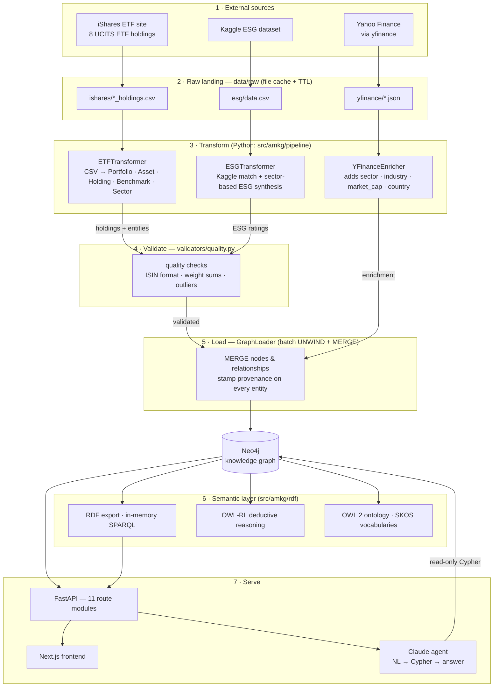
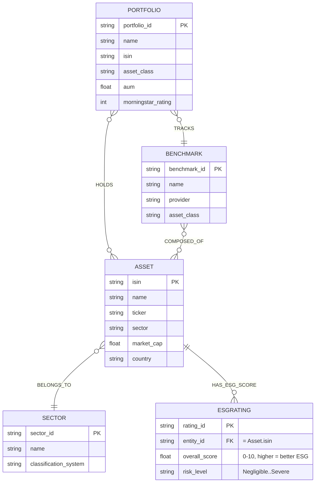
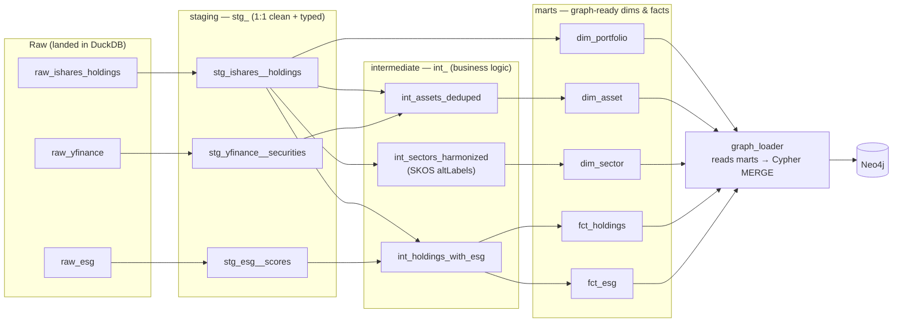

# AMKG — Data Model, Lineage & Transformations

A single-page map of **what the system builds, how data flows through it, and where
every transformation happens** — plus a "practice" view showing exactly where **dbt**
would slot in if the Python transform layer were rebuilt as an ELT project.

All diagrams are [Mermaid](https://mermaid.js.org/) and render directly on GitHub.

> **Downloadable renders** (PNG / SVG / PDF) live in [`docs/diagrams/`](diagrams/) — one
> file per diagram, e.g. `01-end-to-end-lineage.png`. Use the PNGs to feed a diagram to an
> LLM; the `.mmd` sources next to them regenerate the images.

---

## 1. End-to-end data lineage

Raw source → landing cache → transform → validate → load → graph → semantic layer → serving.
Edges are labelled with *what changes* at each hop.

> **Provenance / lineage metadata.** Every node and relationship written by the loader
> carries `_source`, `_ingested_at`, and `_pipeline_run_id`. That means any entity in the
> graph can be traced back to the exact pipeline run and source that produced it — the
> `/api/lineage/{label}/{id}` endpoint surfaces this.

---

## 2. The knowledge graph data model

The graph the loader produces — 5 node labels, 5 relationship types. (Cardinalities are
shown ER-style for intuition; `HOLDS` and `COMPOSED_OF` are genuinely many-to-many.)

**Key modelling fact to remember:** ESG ratings attach to **assets**, never directly to
portfolios. Portfolio-level ESG is *derived* by aggregating over held assets:
`(:Portfolio)-[:HOLDS]->(:Asset)-[:HAS_ESG_SCORE]->(:ESGRating)`.

---

## 3. Transformation catalog

Every transformation, its input and output, and where it lives in code.

| # | Transformation | Input | Output | Code |
|---|----------------|-------|--------|------|
| 1 | Parse ETF holdings | iShares CSV | Portfolio, Asset, Holding, Benchmark, Sector models | `transformers/etf_transformer.py` |
| 2 | Enrich securities | ticker → yfinance JSON | sector, industry, market_cap, country on Asset | `fetchers/yfinance_enricher.py` |
| 3 | Match + synthesize ESG | Kaggle CSV + asset list | ESGRating per asset (matched, else sector-based) | `transformers/esg_transformer.py` |
| 4 | Data-quality validation | holdings + ISINs | pass/fail report (ISIN, weight sums, outliers) | `validators/quality.py` |
| 5 | Load graph | validated models | Neo4j nodes + relationships (MERGE) + provenance | `pipeline/loader.py` |
| 6 | Semantic projection | Neo4j graph | RDF triples, SPARQL, OWL-RL inferences | `rdf/exporter.py`, `rdf/reasoner.py` |
| 7 | NL querying | user question (+ history) | read-only Cypher → answer | `llm/cypher_agent.py` |

Orchestrated by `pipeline/orchestrator.py` as `fetch → transform → validate → load`.

---

## 4. Where dbt fits — the practice view

dbt can't load Neo4j and doesn't model graphs, so it never replaces step 5. But the whole
**transform + validate** block (steps 1–4) is exactly what dbt does declaratively. The
refactor: land raw sources in a warehouse (DuckDB = zero-infra, local), do the "T" as dbt
models, then a thin loader reads the marts into Neo4j.

### Mapping: today (Python) → dbt

Practise by re-implementing each row as a dbt model, top to bottom:

| Today (Python) | dbt model / layer | dbt tests to add |
|----------------|-------------------|------------------|
| `ETFTransformer` parse | `stg_ishares__holdings` | `not_null(isin)`, `not_null(weight_pct)` |
| dedupe assets by ISIN | `int_assets_deduped` | `unique(isin)` |
| sector harmonization (SKOS altLabels, e.g. "Consumer Cyclical" → "Consumer Discretionary") | `int_sectors_harmonized` | `accepted_values(sector, [11 GICS sectors])` |
| `ESGTransformer` (Kaggle + sector synthesis) | `stg_esg__scores` → `int_holdings_with_esg` | `not_null(overall_score)`, range 0–10 |
| `validators/quality.py` weight-sum check | singular test `assert_portfolio_weights_sum_100.sql` | dbt `test` |
| join ESG onto holdings | `fct_esg` (grain: portfolio × asset) | `relationships(asset_isin → dim_asset.isin)` |
| provenance `_source` / `_ingested_at` | `_source` / `_loaded_at` columns + `dbt run` metadata | — |
| `GraphLoader` | `graph_loader` reads `dim_*`/`fct_*` → MERGE | (stays Python/Cypher) |

### Why this pairs well with AMKG specifically

- **Two lineage layers, one story:** dbt's auto-generated DAG/lineage (`dbt docs`) sits
  *upstream* of the graph's own provenance metadata and the RDF/OWL semantic lineage —
  warehouse lineage → graph lineage → semantic lineage.
- **Tests replace hand-rolled validators:** `unique`, `not_null`, `accepted_values`,
  `relationships` cover most of `validators/quality.py` declaratively.
- **Zero infra to practise:** `dbt-duckdb` runs against a single local `.duckdb` file — no
  cloud warehouse needed.

**Suggested first exercise:** rebuild just the iShares path — `raw_ishares_holdings` →
`stg_ishares__holdings` → `int_assets_deduped` → `dim_asset` + `fct_holdings`, with a
`unique(isin)` test and a weight-sum singular test. One source, end to end, is enough to
feel the whole dbt workflow.
